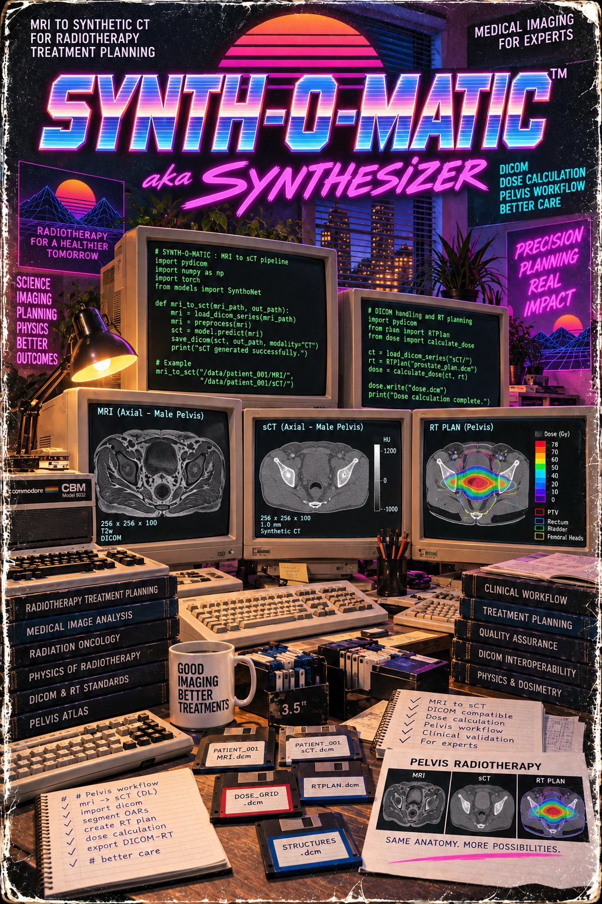

**Synth-O-Matic** is a Python script for 3D Slicer that generates synthetic computed tomography (sCT) images from magnetic resonance imaging (MRI). The GUI workflow combines N4 bias field correction, user-defined tissue segmentations, and adjustable mappings from MRI intensity to Hounsfield units for soft tissue and bone. An interactive interface enables parameter adjustment, image previews, histogram inspection, and visualization of the bone conversion curve. The resulting images and structures can be exported as DICOM CT and RTSTRUCT files using the SlicerRT extension.

**The software is currently a beta version intended for research and development and has not been validated for clinical use.** Further development will address functionality, code structure, usability, and documentation.

The author has limited programming experience and contributes primarily medical physics experience and methodological guidance. Most of the code was generated by GPT-6 Astra under the author’s direction. Independent code review, testing, and contributions are welcome.

